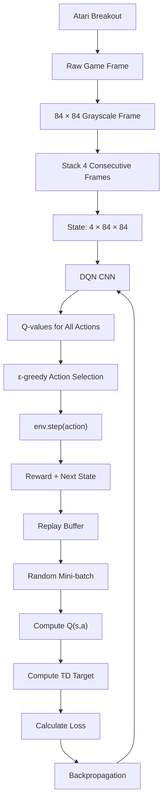

# Atari DQN — Playing Atari with Deep Reinforcement Learning

This repository contains a small-scale implementation and experiment based on:

**Mnih et al. (2013), _Playing Atari with Deep Reinforcement Learning_**  
https://arxiv.org/abs/1312.5602

The project was developed for the **Deep Reinforcement Learning assignment** and demonstrates the main ideas behind the original Deep Q-Network (DQN):

- processing Atari observations;
- stacking consecutive frames to represent motion;
- approximating action-values using a convolutional neural network;
- selecting actions using an ε-greedy policy;
- storing transitions in an experience replay buffer;
- randomly sampling mini-batches from replay memory;
- computing the Q-learning TD target;
- minimising TD error using backpropagation;
- saving and evaluating the trained agent.

This is an **educational, assignment-scale experiment**. It is not intended to reproduce the complete training budget or benchmark results reported in the original paper.

---

## Paper

**Playing Atari with Deep Reinforcement Learning**  
Volodymyr Mnih et al., 2013

Paper:

https://arxiv.org/abs/1312.5602

The central idea is to approximate the action-value function

\[
Q(s,a)
\]

using a convolutional neural network rather than maintaining a tabular Q-function.

The network receives Atari screen observations and produces one estimated Q-value for every possible action:

\[
Q(s,a_1), Q(s,a_2), \ldots, Q(s,a_n)
\]

The action with the greatest estimated value can then be selected:

\[
a^* = \arg\max_a Q(s,a)
\]

while ε-greedy exploration allows the agent to continue trying other actions during training.

---

# Contributors

| Contributor | BITS ID | Main contribution |
|---|---|---|
| Ejaz Ahmed | 2025AG05320 | DQN architecture and paper analysis |
| Arshad Husain Siddiqui | 2025AG05458 | Replay buffer and training loop |
| Sahil Faraz Ansari | 2025AG05719 | Atari preprocessing and experiments |
| Syed Anas Ahmed | 2025AG05726 | Results analysis and presentation |

The Git history, source files, screenshots, experimental outputs and presentation provide supporting evidence of the implementation work.

---

# Repository Structure

```text
aiml-drl-atari/
│
├── LICENSE
├── README.md
├── requirements.txt
├── paper.md
│
├── notebooks/
│   └── dqn_atari_demo.ipynb
│
├── src/
│   ├── dqn.py
│   ├── replay_buffer.py
│   ├── train.py
│   └── evaluate.py
│
├── results/
│   ├── dqn_breakout.pth
│   ├── training_rewards.png
│   ├── loss_curve.png
│   └── gameplay.gif
│
└── references/
    └── ...
```

---

# File Descriptions

## `src/dqn.py`

Defines the convolutional Deep Q-Network.

The network receives four stacked grayscale Atari frames:

```text
(batch_size, 4, 84, 84)
```

and produces:

```text
(batch_size, number_of_actions)
```

For Breakout there are four available actions, so one state produces four Q-values.

The architecture used in this implementation is:

```text
4 × 84 × 84 input
        ↓
Conv2D: 16 filters, 8×8 kernel, stride 4
        ↓
16 × 20 × 20
        ↓
Conv2D: 32 filters, 4×4 kernel, stride 2
        ↓
32 × 9 × 9
        ↓
Flatten
        ↓
2592 values
        ↓
Fully Connected: 256
        ↓
Fully Connected: number of actions
        ↓
Q-values
```

For example:

```text
NOOP     FIRE     RIGHT     LEFT
0.31     0.52      1.84      0.91
```

The greedy action would therefore be `RIGHT`.

Pixels are stored as `uint8` values in the replay buffer and converted inside the network using:

```python
x = x.float() / 255.0
```

This reduces replay-memory requirements while giving the neural network normalized values between 0 and 1.

---

## `src/replay_buffer.py`

Implements **experience replay**.

Every interaction generates a transition:

\[
(s_t,a_t,r_t,s_{t+1},done)
\]

where:

- `state` is the current four-frame state;
- `action` is the action selected by the agent;
- `reward` is the reward returned by Breakout;
- `next_state` is the resulting state;
- `done` indicates whether the episode terminated.

Transitions are stored in a fixed-size replay buffer.

Instead of training only on consecutive experiences such as:

```text
transition 100
transition 101
transition 102
transition 103
```

DQN samples a random mini-batch such as:

```text
transition 871
transition 42
transition 590
transition 123
```

This reduces the strong temporal correlation between consecutive Atari frames.

When the replay buffer reaches its configured capacity, the oldest transitions are automatically discarded as new experiences arrive.

---

## `src/train.py`

Contains the main Atari training loop.

Its responsibilities include:

- creating the `ALE/Breakout-v5` environment;
- preprocessing Atari observations;
- reducing frames to grayscale 84×84 images;
- maintaining a stack of four frames;
- selecting actions using ε-greedy exploration;
- adding transitions to replay memory;
- sampling random mini-batches;
- calculating the TD target;
- calculating the training loss;
- running backpropagation;
- recording episode rewards;
- saving plots;
- saving the trained network.

The core DQN target used is:

\[
y =
r + \gamma \max_{a'} Q(s',a')
\]

for a non-terminal state.

For a true terminal state:

\[
y=r
\]

because no future reward remains.

The predicted value for the action actually taken is:

\[
Q(s,a)
\]

and the network attempts to reduce the difference between the target and current estimate.

Conceptually:

\[
\delta =
y-Q(s,a)
\]

where \(\delta\) is the TD error.

---

## `src/evaluate.py`

Loads the saved network:

```text
results/dqn_breakout.pth
```

and evaluates it without updating the neural network.

The evaluation stage:

- loads the trained model;
- runs several complete Breakout episodes;
- selects actions using the learned Q-values;
- records the episode score;
- calculates mean, minimum and maximum evaluation reward;
- saves gameplay as:

```text
results/gameplay.gif
```

Evaluation is deliberately separated from training so that we can measure what the learned policy does without modifying its weights.

---

## `notebooks/dqn_atari_demo.ipynb`

Provides a notebook-based demonstration and explanation of the experiment.

It can be used to illustrate:

- the Atari observation;
- frame preprocessing;
- stacked frames;
- DQN architecture;
- training outputs;
- plots;
- evaluation results.

The core implementation remains in the files under `src/`.

---

## `paper.md`

Contains notes related to the assigned research paper and links the paper concepts to the implementation.

---

## `results/`

Contains experiment outputs.

Typical files are:

```text
dqn_breakout.pth
```

Saved PyTorch model parameters.

```text
training_rewards.png
```

Episode reward during training.

```text
loss_curve.png
```

DQN optimisation loss during training.

```text
gameplay.gif
```

Example gameplay generated during evaluation.

---

# Implementation Flow



The complete learning loop is therefore:

```text
state
   ↓
DQN
   ↓
Q-values
   ↓
ε-greedy action
   ↓
Breakout environment
   ↓
reward + next state
   ↓
experience replay
   ↓
random mini-batch
   ↓
TD target
   ↓
loss
   ↓
backpropagation
   ↓
updated DQN
```

---

# Experience Replay

The replay buffer is an important part of DQN.

Without replay, learning would occur directly from temporally adjacent transitions:

```text
s1 → s2 → s3 → s4 → s5
```

These observations are strongly correlated.

Experience replay instead stores many previous transitions and randomly samples them:

```text
Replay Memory
──────────────────────────
Transition 1
Transition 2
Transition 3
...
Transition N
──────────────────────────
          ↓
   Random sampling
          ↓
    Mini-batch of 32
```

This provides more varied training examples and allows previous experiences to be reused.

---

# ε-Greedy Exploration

During training, actions are selected using an ε-greedy policy:

\[
A_t =
\begin{cases}
\text{random action}, & \text{with probability }\epsilon \\
\arg\max_a Q(S_t,a), & \text{with probability }1-\epsilon
\end{cases}
\]

At the beginning:

```text
ε ≈ 1
```

so the agent mostly explores.

As training progresses:

```text
ε decreases
```

and the agent increasingly uses the actions preferred by its learned Q-network.

For example:

```text
Epsilon = 0.95
```

means approximately:

```text
95% random exploration
5% greedy DQN action
```

whereas:

```text
Epsilon = 0.10
```

means approximately:

```text
10% random exploration
90% greedy DQN action
```

---

# Training Output

A typical training line looks like:

```text
Episode 82 | Steps 15511 | Reward 5.00 | Avg10 1.90 | Epsilon 0.860 | Replay 15511
```

The fields mean:

| Field | Meaning |
|---|---|
| `Episode` | Number of completed Breakout episodes |
| `Steps` | Total environment interactions so far |
| `Reward` | Total original game reward obtained in that episode |
| `Avg10` | Mean reward over the previous 10 episodes |
| `Epsilon` | Current ε-greedy exploration probability |
| `Replay` | Number of transitions currently stored in replay memory |

`Reward` is not a score "out of" a fixed number.

For example:

```text
Reward = 5
```

means that the agent accumulated a total reward of 5 during that episode.

`Avg10` is more useful for identifying trends because individual episode rewards can vary considerably.

---

# Requirements

The implementation uses:

- Python
- PyTorch
- Gymnasium
- Arcade Learning Environment (`ale-py`)
- NumPy
- Matplotlib
- OpenCV
- ImageIO

Install dependencies using:

```bash
python -m pip install -r requirements.txt
```

A typical `requirements.txt` contains packages such as:

```text
torch
torchvision
gymnasium
ale-py
numpy
matplotlib
opencv-python
imageio
```

---

# Running the Project

Run all commands from the repository root.

For example:

```text
C:\gitHub\aiml-drl-atari
```

## 1. Activate the virtual environment

Windows:

```bat
.venv\Scripts\activate
```

The command prompt should then show something similar to:

```text
(.venv) C:\gitHub\aiml-drl-atari>
```

---

## 2. Install dependencies

```bat
python -m pip install -r requirements.txt
```

---

## 3. Test the DQN network

```bat
python src\dqn.py
```

Expected output includes:

```text
Input shape : torch.Size([32, 4, 84, 84])
Output shape: torch.Size([32, 4])
```

This confirms that 32 states containing four 84×84 frames successfully pass through the neural network and produce four Q-values per state.

---

## 4. Test the replay buffer

```bat
python src\replay_buffer.py
```

Example:

```text
Replay buffer size: 10

States shape     : torch.Size([4, 4, 84, 84])
Actions shape    : torch.Size([4])
Rewards shape    : torch.Size([4])
Next states shape: torch.Size([4, 4, 84, 84])
Dones shape      : torch.Size([4])
```

This verifies that transitions can be stored and sampled correctly.

---

## 5. Train the DQN

```bat
python src\train.py
```

Training displays progress such as:

```text
Episode 100 | Steps 18699 | Reward 1.00 | Avg10 1.30 | Epsilon 0.832 | Replay 18699
```

When training finishes, the model is stored as:

```text
results/dqn_breakout.pth
```

and the training plots are saved as:

```text
results/training_rewards.png
results/loss_curve.png
```

---

## 6. Evaluate the trained model

```bat
python src\evaluate.py
```

Evaluation loads:

```text
results/dqn_breakout.pth
```

and reports statistics such as:

```text
Mean reward
Minimum reward
Maximum reward
```

Gameplay is saved as:

```text
results/gameplay.gif
```

---

# Verified Pipeline

During development the following components were tested successfully:

```text
Atari environment starts             ✓
Breakout action space detected       ✓
84×84 preprocessing works            ✓
Four-frame state stacking works      ✓
DQN receives states                  ✓
DQN produces Q-values                ✓
Actions execute in ALE               ✓
Replay buffer stores transitions     ✓
Random mini-batches are sampled      ✓
TD loss is calculated                ✓
Backpropagation executes             ✓
Training loop completes              ✓
Model checkpoint saves successfully  ✓
Checkpoint reload works              ✓
Evaluation executes                  ✓
Gameplay GIF is generated            ✓
```

---

# Experimental Results

## Example experiment

The results below correspond to **one particular training and evaluation run** and should not be interpreted as the benchmark results of the Mnih et al. paper.

The trained model was subsequently evaluated over **1,000 Breakout episodes**.

Observed evaluation results:

| Metric | Result |
|---|---:|
| Evaluation episodes | 1,000 |
| Mean reward | **1.63** |
| Minimum reward | **0.00** |
| Maximum reward | **12.00** |

Example evaluation episodes included:

```text
Episode 980  | Reward 8.00
Episode 992  | Reward 7.00
Episode 1000 | Reward 5.00
```

while a number of episodes still obtained a reward of zero.

The mean evaluation reward was:

\[
\bar{R}=1.63
\]

This indicates that the learned policy was capable of scoring in Breakout, including occasional substantially higher-scoring episodes, but performance remained variable.

The maximum observed score of 12 demonstrates that the network had learned action behaviour capable of achieving considerably better outcomes in some episodes than its average performance.

However, the large number of low or zero-reward episodes shows that the learned policy had **not converged to a consistently strong Breakout strategy**.

---

# Analysis of the Experiment

The experiment should be interpreted as an implementation validation rather than a reproduction of the full Atari benchmark.

Several observations are important.

### 1. The complete DQN pipeline worked

The experiment demonstrated:

```text
Atari observations
        ↓
CNN Q-network
        ↓
ε-greedy interaction
        ↓
experience replay
        ↓
TD learning
        ↓
gradient optimisation
        ↓
trained model
        ↓
independent evaluation
```

This confirms that all major algorithmic components of the implementation interact correctly.

### 2. Evaluation performance was variable

Although the mean evaluation reward reached 1.63, many evaluation episodes still obtained a reward of zero.

This suggests that the learned behaviour was not yet robust across episodes.

### 3. High individual scores do not prove convergence

An episode score such as:

```text
12
```

shows that the learned agent can produce successful trajectories.

However, DQN performance should not be assessed from the best individual episode alone.

The more useful measures are:

- mean evaluation reward;
- moving-average training reward;
- performance over many independent episodes;
- comparison against a random baseline.

### 4. Loss alone is not sufficient

A decreasing or stable TD loss indicates that the network is fitting its current TD targets.

It does **not automatically imply** that gameplay performance has improved.

For that reason, this repository separately evaluates the trained policy using complete Breakout episodes.

---

# Differences From the Original Paper

This repository demonstrates the core concepts of the 2013 DQN paper but does not attempt an exact reproduction.

Important differences include:

- only Breakout is used;
- the experiment uses a much smaller training budget;
- modern Gymnasium/ALE is used rather than the original Atari interface;
- training hardware differs from the original study;
- the implementation is designed for educational clarity;
- evaluation settings are assignment-scale;
- results should therefore not be directly compared with the paper's benchmark table.

The objective is:

> to demonstrate how the DQN algorithm described in the paper can be implemented and experimentally evaluated.

It is not:

> to claim reproduction of the original published Atari performance.

---

# DQN Version Used

This project focuses on the DQN formulation described in the assigned 2013 paper.

The next-state value is calculated using the same Q-network while gradients are disabled:

\[
y =
r+\gamma\max_{a'}Q(s',a')
\]

This implementation therefore does not present later techniques such as:

- Double DQN;
- Dueling DQN;
- Prioritized Experience Replay;

as though they were part of the original assigned paper.

These are subsequent improvements to the DQN family.

---

# Breakout Environment Note

Breakout has four actions:

```text
NOOP
FIRE
RIGHT
LEFT
```

`FIRE` is required to launch the ball.

Environment-specific handling of the initial launch may therefore be used so that an episode does not remain indefinitely at the initial game state.

This is an Atari environment detail rather than a modification to the DQN learning rule.

---

# Outputs Used for the Assignment

The implementation produces several forms of evidence that can be included in the presentation and recording:

### Network architecture

```text
src/dqn.py
```

### Experience replay implementation

```text
src/replay_buffer.py
```

### Training procedure

```text
src/train.py
```

### Independent evaluation

```text
src/evaluate.py
```

### Learned parameters

```text
results/dqn_breakout.pth
```

### Reward plot

```text
results/training_rewards.png
```

### TD-loss plot

```text
results/loss_curve.png
```

### Gameplay evidence

```text
results/gameplay.gif
```

Together, these allow the implementation to be traced from:

```text
Paper
  ↓
Algorithm
  ↓
Code
  ↓
Training
  ↓
Saved model
  ↓
Evaluation
  ↓
Results
```

---

# Conclusion

This repository demonstrates an end-to-end implementation of the principal ideas in **Playing Atari with Deep Reinforcement Learning**.

The implementation successfully combines:

- convolutional neural-network function approximation;
- Atari image observations;
- four-frame state representations;
- ε-greedy exploration;
- experience replay;
- Q-learning TD targets;
- RMSprop optimisation;
- neural-network backpropagation;
- model persistence;
- independent policy evaluation.

In the **particular experimental run documented above**, the trained agent achieved a mean evaluation reward of **1.63 over 1,000 episodes**, with scores ranging from **0 to 12**.

These results demonstrate that the implementation can learn behaviours capable of obtaining rewards in Breakout. However, the high variation between episodes shows that this relatively small experiment did not produce a consistently strong or converged Atari policy.

Therefore, the experimental results should be interpreted as **evidence that the DQN implementation and learning pipeline operate successfully**, rather than as a reproduction of the benchmark results reported in the original paper.

---

# Reference

Mnih, V., Kavukcuoglu, K., Silver, D., Graves, A., Antonoglou, I., Wierstra, D., & Riedmiller, M. (2013).

**Playing Atari with Deep Reinforcement Learning**

arXiv:1312.5602

https://arxiv.org/abs/1312.5602
